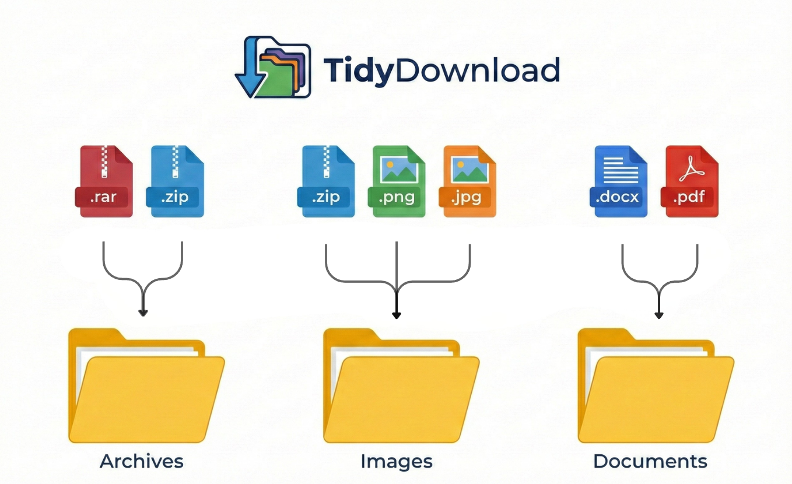

# TidyDownload - 下载自动归类助手

Edge商店：[点击访问](https://microsoftedge.microsoft.com/addons/detail/tidydownload-%E4%B8%8B%E8%BD%BD%E8%87%AA%E5%8A%A8%E5%BD%92%E7%B1%BB%E5%8A%A9%E6%89%8B/mcjhakkpoofnkjhijhheifokkboikklf)

基于 Chrome Manifest V3 的智能文件整理扩展，支持按文件类型或按时间自动整理下载文件，让你的下载文件夹从此井井有条。



## 核心功能

- **自动归档**：支持两种整理方式：
  - 按类型分类：根据文件扩展名自动归档到 Images、Documents、Videos、Audio、Archives、Apps 等文件夹。
  - 按时间分类：支持 `YYYY-MM` 单层目录和 `YYYY/MM` 双层目录两种结构。
- **隐私优先**：本地运行，不收集任何数据。详情请参阅 [隐私政策](PRIVACY.md)。
- **多语言支持**：支持 简体中文、繁体中文、英语、日语、韩语、法语、西班牙语、阿拉伯语、葡萄牙语、俄语、德语、印尼语、泰语、越南语、土耳其语、意大利语、波兰语、荷兰语、瑞典语、印地语、希腊语。
- **灵活配置**：
  - 可自定义分类规则、扩展名和目标文件夹。
  - 支持按模式切换相关设置，交互更清晰统一。
  - 设置页会在存在未保存修改时提醒，避免误切换或误关闭。
- **极简体验**：
  - 现代化 UI 设计 (Glassmorphism + Bento Box)。
  - 弹窗一键开关智能分类功能，并显示当前分类策略。

## 快速开始

1. **安装扩展**：
   - 打开 Chrome 浏览器，访问 `chrome://extensions/`。
   - 开启右上角的 **“开发者模式”**。
   - 点击 **“加载已解压的扩展程序”**，选择本项目的根目录。

2. **使用说明**：
   - 安装后，点击浏览器右上角的扩展图标。
   - **Popup 弹窗**：可快速查看运行状态（运行中/已暂停）、当前分类策略，或进入设置页。
   - **设置页**：
     - **整理模式**：可在“按类型分类”和“按时间分类”之间切换。
     - **时间目录结构**：按时间分类时，可选 `YYYY-MM` 或 `YYYY/MM`。
     - **添加规则**：点击 “+” 号卡片添加新的分类规则。
     - **编辑规则**：点击已有卡片修改文件夹名称或扩展名列表。
     - **切换语言**：左下角选择你熟悉的语言，界面即刻更新。

## 目录结构

```text
/TidyDownload
  ├── manifest.json       # 扩展配置文件 (MV3)
  ├── background.js       # 后台服务 (处理按类型/按时间的下载整理逻辑)
  ├── popup.html          # 弹窗界面
  ├── popup.js            # 弹窗逻辑 (i18n, 状态切换, 当前策略显示)
  ├── options.html        # 设置页面
  ├── options.js          # 设置逻辑 (模式切换, 规则管理, 多语言, 未保存提醒)
  ├── style.css           # 全局样式 (Glassmorphism, Bento Grid)
  └── icons/              # 图标资源
```

## UI 风格

- **设计语言**：Modern Minimalist + Glassmorphism + Bento Box
- **配色方案**：
  - 主色调：`#6366f1` (Indigo)
  - 背景色：`#f8fafc` (Slate 50)
- **技术栈**：原生 HTML/CSS/JS (零依赖，轻量级，完全符合 CSP 规范)

## 开发日志

- **v1.1.0**: 新增按时间分类模式、时间目录结构配置、弹窗策略显示与未保存修改提醒。
- **v1.0.0**: 初始版本发布，支持基础自动分类。

---

# TidyDownload - Download Organizer

Edge：[Download](https://microsoftedge.microsoft.com/addons/detail/tidydownload-%E4%B8%8B%E8%BD%BD%E8%87%AA%E5%8A%A8%E5%BD%92%E7%B1%BB%E5%8A%A9%E6%89%8B/mcjhakkpoofnkjhijhheifokkboikklf)

A smart file organization extension based on Chrome Manifest V3 that organizes downloaded files automatically by file type or by date, keeping your download folder clean and predictable.


## Core Features

- **Automatic Archiving**: Supports two organization strategies:
  - By type: Automatically classifies downloads into Images, Documents, Videos, Audio, Archives, Apps, etc. based on file extensions.
  - By date: Supports both `YYYY-MM` single-folder layout and `YYYY/MM` two-level folder layout.
- **Privacy First**: Local processing, no data collection. See [Privacy Policy](PRIVACY.md) for details.
- **Multi-language Support**: Support for Simplified Chinese, Traditional Chinese, English, Japanese, Korean, French, Spanish, Arabic, Portuguese, Russian, German, Indonesian, Thai, Vietnamese, Turkish, Italian, Polish, Dutch, Swedish, Hindi, Greek.
- **Flexible Configuration**:
  - Customizable classification rules, extensions, and target folders.
  - Clear mode-based settings for type organization and date organization.
  - Unsaved-change warnings help prevent accidental navigation or closing.
- **Minimalist Experience**:
  - Modern UI Design (Glassmorphism + Bento Box).
  - One-click toggle in the popup, plus a visible indicator of the current organization strategy.

## Quick Start

1. **Install Extension**:
   - Open Chrome browser and visit `chrome://extensions/`.
   - Enable **"Developer mode"** in the top right corner.
   - Click **"Load unpacked"** and select the root directory of this project.

2. **Instructions**:
   - After installation, click the extension icon in the browser toolbar.
   - **Popup**: Quickly view status (Running/Paused), current strategy, or enter the settings page.
   - **Settings Page**:
     - **Organization Mode**: Switch between type-based and date-based organization.
     - **Date Folder Layout**: Choose `YYYY-MM` or `YYYY/MM` when date mode is active.
     - **Add Rule**: Click the "+" card to add a new classification rule.
     - **Edit Rule**: Click existing cards to modify folder names or extension lists.
     - **Switch Language**: Select your language in the bottom left, the interface updates instantly.

## Directory Structure

```text
/TidyDownload
  ├── manifest.json       # Extension Configuration (MV3)
  ├── background.js       # Background Service (Handles type/date-based download organization)
  ├── popup.html          # Popup Interface
  ├── popup.js            # Popup Logic (i18n, status toggle, strategy display)
  ├── options.html        # Settings Page
  ├── options.js          # Settings Logic (mode switching, rule management, i18n, unsaved-change guard)
  ├── style.css           # Global Styles (Glassmorphism, Bento Grid)
  └── icons/              # Icon Resources
```

## UI Style

- **Design Language**: Modern Minimalist + Glassmorphism + Bento Box
- **Color Scheme**:
  - Primary: `#6366f1` (Indigo)
  - Background: `#f8fafc` (Slate 50)
- **Tech Stack**: Native HTML/CSS/JS (Zero dependencies, lightweight, fully CSP compliant)

## Dev Log

- **v1.1.0**: Added date-based organization mode, date folder layout settings, popup strategy display, and unsaved-change warnings.
- **v1.0.0**: Initial release, supports basic auto-classification.
